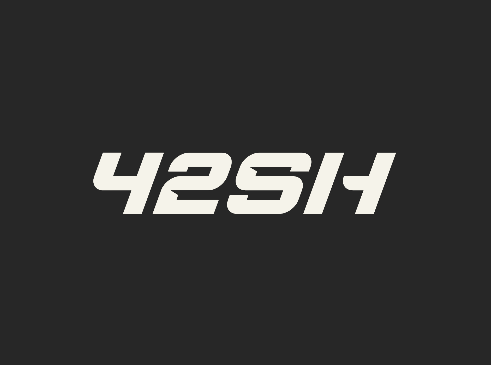

<div id="top"></div>

[![Contributors][contributors-shield]][contributors-url]
[![Forks][forks-shield]][forks-url]
[![Stargazers][stars-shield]][stars-url]
[![Issues][issues-shield]][issues-url]
[![MIT License][license-shield]][license-url]


<!-- PROJECT LOGO -->
<div align="center">
  <a href="https://github.com/LilianSchall/42sh">
    
  </a>

  <h3 align="center">42sh</h3>
  <p align="center">
    This is the official repository of the posix shell 42sh, a school project at EPITA.
    ·
    <a href="https://github.com/LilianSchall/42sh/issues">Report Bug</a>
    ·
    <a href="https://github.com/LilianSchall/42sh/issues">Request Feature</a>
  </p>
</div>


<!-- TABLE OF CONTENTS -->
<details>
  <summary>Table of Contents</summary>
  <ol>
    <li>
      <a href="#about-the-project">About The Project</a>
      <ul>
        <li><a href="#built-with">Built With</a></li>
      </ul>
    </li>
    <li>
      <a href="#getting-started">Getting Started</a>
      <ul>
        <li><a href="#prerequisites">Prerequisites</a></li>
        <li><a href="#installation">Installation</a></li>
      </ul>
    </li>
    <li><a href="#features">Features</a></li>
    <li><a href="#contributors">Contributors</a></li>
    <li><a href="#license">License</a></li>
    <li><a href="#contact">Contact</a></li>
  </ol>
</details>

<!-- SYNOPSIS -->
## Synopsis: ⚠️ Think yourself, don't cheat!

This project has been made public in order to promote the accomplishment of it by the 4 contributors of the repository. Future student of EPITA **MUST** not recreate this repository or they will be flagged as cheaters. Be advised.

<!-- ABOUT THE PROJECT -->
## About The Project

42sh is a one month long school project at EPITA. It can be summarised as the development in team of 4 people of posix compliant shell that follows the SCL.

<p align="right">(<a href="#top">back to top</a>)</p>

### Built With

This project has been built only in standard C99.

<p align="right">(<a href="#top">back to top</a>)</p>

<!-- GETTING STARTED -->
## Getting Started

To get a local copy up and running follow these simple example steps.

### Prerequisites

In order to compile the project you will mainly need two specific utils:
  ```sh
    ninja
  ```
  ```sh
    meson
  ```
  ```sh
    gcc
  ```  

### Installation

1. Clone the repo
   ```sh
   git clone https://github.com/LilianSchall/42sh.git
   ```
2. In the repo, compile the project.
   ```sh
   meson setup build; ninja -C build
   ```

3. Launch the shell !
  ```sh
    # Launch in interactive mode
    ./build/42sh
    # launch in command line mode
    ./build/42sh -c "your command"
    # launch a given script
    ./build/42sh script.sh
  ```

<p align="right">(<a href="#top">back to top</a>)</p>


<!-- FEATURES -->
## Features

42sh is a posix shell and for this reason, it can execute all the features that are requested by the SCL. You can find the SCL right [here](https://pubs.opengroup.org/onlinepubs/9699919799/utilities/V3_chap02.html).

<p align="right">(<a href="#top">back to top</a>)</p>

<!-- LICENSE -->
## License

This is a project from the school EPITA. All rights are the property of EPITA. Though, nobody asked not to open source it.

<p align="right">(<a href="#top">back to top</a>)</p>

<!-- CONTRIBUTORS -->

## Contributors

A huge thank you for the contribution of the team I have lead during this project. The contributors of this project are:
- [Lilian Schall](https://github.com/LilianSchall)
- [Quentin Kuttler](https://github.com/QuentinKuttler)
- [Theo Schandel](https://github.com/theoschandel)
- [Clement Ehatt](https://github.com/Clems133)

<!-- CONTACT -->
## Contact

Lilian Schall - [@LilianSchall](https://twitter.com/LilianSchall)

Project Link: [https://github.com/LilianSchall/42sh](https://github.com/LilianSchall/42sh)

<p align="right">(<a href="#top">back to top</a>)</p>

[contributors-shield]: https://img.shields.io/github/contributors/LilianSchall/42sh.svg?style=for-the-badge
[contributors-url]: https://github.com/LilianSchall/42sh/graphs/contributors
[forks-shield]: https://img.shields.io/github/forks/LilianSchall/42sh.svg?style=for-the-badge
[forks-url]: https://github.com/LilianSchall/42sh/network/members
[stars-shield]: https://img.shields.io/github/stars/LilianSchall/42sh.svg?style=for-the-badge
[stars-url]: https://github.com/LilianSchall/42sh/stargazers
[issues-shield]: https://img.shields.io/github/issues/LilianSchall/42sh.svg?style=for-the-badge
[issues-url]: https://github.com/LilianSchall/42sh/issues
[license-shield]: https://img.shields.io/github/license/LilianSchall/42sh.svg?style=for-the-badge
[license-url]: https://github.com/LilianSchall/42sh/blob/main/LICENSE
